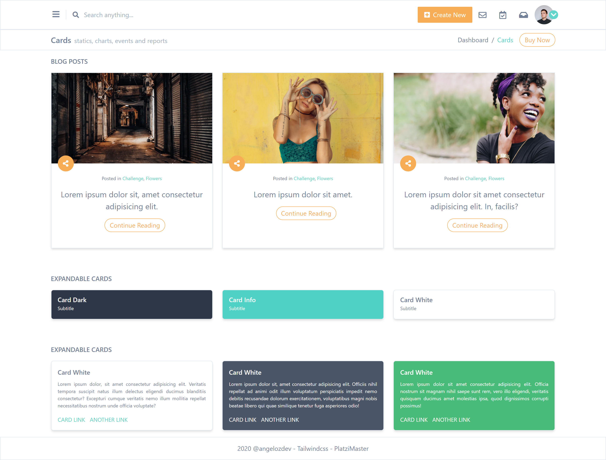

# Tailwind Project

_It is a static page where you use [Tailwindcss](https://tailwindcss.com/) for your layout._

## Starting

_You can clone this repository to have the project local:_

```bash
git clone https://github.com/angelozdev/tailwind-design.git
```

_Install the necessary dependencies in the root of the project._

```bash
npm install
```

_Run the following command to start the project in development mode:_

```bash
npm run dev
```

## Deploy

_You can see the project in production [Tailwind Project](https://angelozdev.github.io/tailwind-design/public/)_

## Built with

_Technologies used in the frontend.:_
-  **[Tailwindcss](https://tailwindcss.com/)** Tailwind CSS is a highly customizable, low-level CSS framework that gives you all of the building blocks you need to build bespoke designs without any annoying opinionated styles you have to fight to override.
- **[PostCSS](https://postcss.org/)** A tool for transforming CSS with JavaScript


## Preview


## License

This project is under the License (MIT) - see the file [LICENSE.md](LICENSE.md) for details
